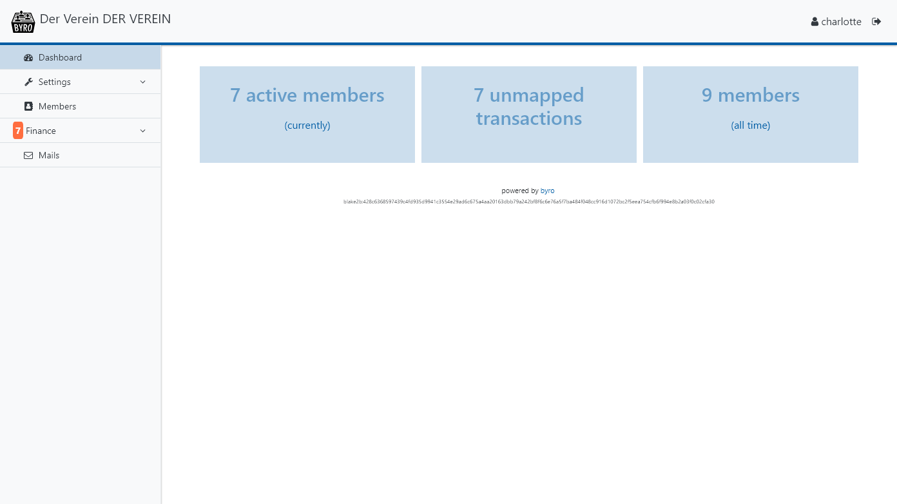
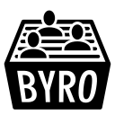

|byro|
======

.. image:: https://github.com/byro/byro/actions/workflows/tests.yml/badge.svg?branch=master
   :target: https://github.com/byro/byro/actions/workflows/tests.yml?query=branch%3Amaster
   :alt: CI tests

.. image:: https://github.com/byro/byro/actions/workflows/style.yml/badge.svg?branch=master
   :target: https://github.com/byro/byro/actions/workflows/style.yml?query=branch%3Amaster
   :alt: CI code style

.. image:: https://codecov.io/gh/byro/byro/branch/master/graph/badge.svg
   :target: https://codecov.io/gh/byro/byro
   :alt: Code coverage

.. image:: https://img.shields.io/codeclimate/maintainability/byro/byro.svg
   :target: https://codeclimate.com/github/byro/byro
   :alt: Code maintainability

.. image:: https://readthedocs.org/projects/byro/badge/?version=latest
   :target: http://byro.readthedocs.io/en/latest/?badge=latest
   :alt: Documentation

byro_ is a membership administration tool for small and medium sized
clubs/NGOs/associations of all kinds, with a focus on the DACH region. While it
is still a work in progress, it is already usable and in active use.

Development and Production Setup
--------------------------------

Please refer to the `development`_ or the `production documentation`_.

Features
--------

Planned features
----------------

Official Plugins
----------------

byro provides a rich API for plugins. See our `developer documentation`_ if you want to write a
plugin. If you want your plugin to be officially recognized or listed here, please open an issue
or a pull request.

- `byro-mailman`_ provides integration with the mailman mailing list tool,
  including automatic subscriptions, member lists, and removals.
- `byro-gemeinnuetzigkeit`_ provides tools for German non-profits, most notably
  receipts for membership fees and donations.

Inofficial Plugins
------------------

Inofficial plugins are encouraged to add the `byro-plugin` tag if they are on
GitHub. You can see all byro plugins on GitHub `here`_.

- `byro-shackspace`_ is an example for how a group can extend or modify byro to
  fit their purpose, e.g. add custom mechanisms and save additional data.

.. _developer documentation: http://byro.readthedocs.io/en/latest/
.. _development: https://byro.readthedocs.io/en/latest/developer/setup.html
.. _byro: https://byro.cloud
.. _here: https://github.com/topics/byro-plugin
.. _byro-mailman: https://github.com/byro/byro-mailman
.. _byro-gemeinnuetzigkeit: https://github.com/byro/byro-gemeinnuetzigkeit
.. _byro-shackspace: https://github.com/byro/byro-shackspace
.. _production documentation: https://byro.readthedocs.io/en/latest/administrator/
